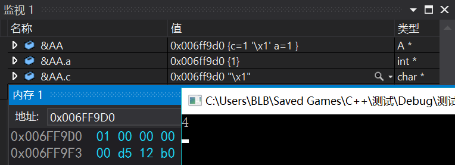

#### 判断机器大小端

- 大端模式：是指数据的低位（就是权值较小的后面那几位）保存在内存的高地址中，而数据的高位，保存在内存的低地址处中，这样的存储模式有点儿类似于把数据当作字符串顺序处理：地址由小向大增加，而数据从高位往低位放；

- 小端模式：是指数据的低位保存在内存的低地址中，而数据的高位保存在内存的高地址中，和我们的逻辑方法一致。

```
union A {
	char c;
	int  a;
	/* 其中 a 和 c 的地址相同共用一份内存 */
};

int main()
{
	A AA;
	AA.a = 1;
	std::cout << sizeof(AA) << std::endl;
	if (AA.a == AA.c) std::cout << "little-endian\n";
	else			std::cout << "big-endian\n";
	return 0;
}
/* 
 *	如果是大端机此时高地址存低位，所以 AA.c 为 0；
 *	如果是小端机此时底地址存低位，AA.a 与 AA.c 都为 1。
 */
```


- 所以这台机子时小端机

00
00
00
01  <- 0x006FF9D0