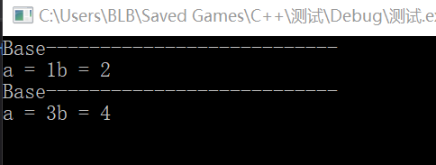
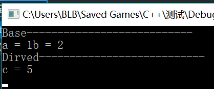

###### 本篇博客主要讲解c++特性之一多态
###### 参考资料：c++ 面向对象程序设计、[hackbuteer1:浅谈c++多态性](http://blog.csdn.net/hackbuteer1/article/details/7475622)
###### 邮箱：blbagony@163.com
###### 10. 十二月 2017 02:50下午 
---

##### C++多态
- 多态最初的含义是一种事物有多种形态，c++ 的多态的特性可以简单概括为“一个接口，多种方法”，程序在运行时才决定调用的函数，他是面向对象编程领域的核心概念。

- C++的多态性是通过虚函数来实现的，虚函数允许子类重新定义父类的成员函数，子类重新定义父类的方法称为覆盖（override），或者成为重写[^1]而重载则是允许有多个同名的函数，这些函数的参数列表不同，参数类型不同，或者两者都不同。编译星期日, 
器会根据这些函数的不同列表，将同名的函数作修饰，从而生成一些不同名称的预处理函数，通过这种方法实现同名函数调用时的重载问题。但这并没有体现多态特性。

- 多态非多态的实质区别就是函数早绑定还是晚绑定。如果函数的调用，在编译器编译期间就可以确定函数的调用地址，并产生代码，属于静态编译，就是说函数地址是早绑定的。而如果函数的地址在编译期间不能确定，需要运行时才能确定，这就属于动态链接，晚绑定。

- 多态的作用是什么呢？封装可以使得代码模块化，集成可以扩展已存在的代码，他们的目的都是为了代码重用。而多态的目的是为了接口的重用。也就是说不论究竟是类的对象还是函数，都能通过同一个接口调用到适应各自对象的实现方法。

- 最常用的方法就是声明基类的指针，利用该指针指向任意一个子类的对象，调用相应的虚函数，可以根据指向的子类的不同而实现不同的方法。如果没有使用虚函数的话，即没有利用 c++ 的多态性，当利用基类指针调用相应的函数时，将总被限制在基类函数本身，而无法调用到子类中被重写过的函数。因为没有多态的特性，函数调用的地址将是一定的，固定的地址将会调用到同一个函数，这就无法实现同一个接口多种方法的目的了。

###### 虚函数
虚函数是重载的另一种表现形式。只是一种动态重载的方式，它提供了一种更为灵活的、运行时的多态性机制。虚函数允许函数调用与函数体之间的联系在运行才建立，也就是在运行时才决定如何动作，即所谓动态连编。
```cpp
class Base{
public:
	Base(int x, int y)	//声明基类 Base
	{
		_a = x; 
		_b = y;
	}
	void show()		//基类成员函数show()
	{
		std::cout << "Base---------------------------\n";
		std::cout << "a = " << _a << "b = " << _b << std::endl;
	}
private:
	int _a;
	int _b;
};

class Derived :public Base{
public:
	Derived(int x, int y, int z) :Base(x, y)	//声明派生类Derived
	{
		_c = z;
	}
	void show()	//派生类成员函数 show()
	{
		std::cout << "Dirved---------------------------\n";
		std::cout << "c = " << _c << std::endl;
	}
private:
	int _c;
};

int main()
{
	Base *pb, base(1,2);	//定义基类指针和对象
	Derived derived(3, 4, 5);	//定义派生类对象
	pb = &base;
	pb->show();
	pb = &derived;	//基类指针指向派生类对象
	pb->show();		//覆盖
	return 0;
}
```


<font color = red>解释</font>：基类指针可以指向其共有派生类对象，但当其指向共有派生类对象时，他只能访问派生类中从基类继承来的成员，而不能访问从共有派生类中定义的成员。

---
######虚函数的作用和定义
1. 虚函数的作用
虽然指针 pb 指向了派生类对象，但其所调用的成员函数 show() 仍然是基类对象的 show。在这种情况下，若要调用派生类中的成员函数可以采用显示的方法。
例如：
```cpp
derived.show();
```
或者强制类型转换
```cpp
((Derived*)pc)->show(); 
```
但是，使用对象指针的目的就是为了表达一种动态的性质，即当指针指向不同对象时2执行不同的操作，显然以上两种方法都没有起到这种作用。其实只要将成员函数 show()说明为虚函数，就能实现这种动态调用功能。

```cpp
#include <iostream>

class Base{
public:
	Base(int x, int y)
	{
		_a = x; 
		_b = y;
	}
	virtual void show()		//定义虚函数show()
	{
		std::cout << "Base---------------------------\n";
		std::cout << "a = " << _a << "b = " << _b << std::endl;
	}
private:
	int _a;
	int _b;
};

class Derived :public Base{
public:
	Derived(int x, int y, int z) :Base(x, y)
	{
		_c = z;
	}
	void show()	//重新定义虚函数
	{
		std::cout << "Dirved---------------------------\n";
		std::cout << "c = " << _c << std::endl;
	}
private:
	int _c;
};

int main()
{
	Base *pb, base(1,2);
	Derived derived(3, 4, 5);
	pb = &base;	
	pb->show();	//调用基类虚函数
	pb = &derived;
	pb->show();	//调用派生类虚函数show()
	return 0;
}
```

解释：为什么将基类成员函数定义为虚函数时，程序执行结果就正确了？这是因为，关键字 <font color = #3300cc>virtual</font> 指示编译器，函数调用 `pb->show();`要在运行时确定所要调用的函数，即需要动态连编。因此，程序在运行时根据指针 pb 所指向的实际对象，调用该对象的成员函数 。
2. 虚函数的定义
虚函数的定义是在基类中进行的，基类中需要定义为虚函数的成员函数的声明冠以关键字 <font color = #3300cc>virtual</font>。
```
virtual 返回类型  函数名(形参表)
{
	函数体
}
```
<font color = #3300cc>在基类中的某个函数声明为虚函数后，此虚函数就可以在一个或多个派生类中被重新定义。虚函数在派生类中重新定义时，其函数原型，包括返回值类型、函数名、参数个数、参数类型顺序，都必须与基类中的原型完全相同。</font>
3. 对虚函数做点说明

- 虚函数使用的基础是赋值兼容规则，赋值兼容规则成立的条件是派生类从其基类共有派生。因此，通过虚函数来使用多态性机制时，<font color = #3300cc>派生类必须从其基类共有派生</font>。

- <font color = #3300cc>必须从基类中首先定义虚函数</font>。由于“基类”与“派生类”是相对的，因此这项说明并不表明必须在类等基最高层类中中声明虚函数。在实际应用中，应该在类等级内需要具有动态多态性的几个层次中的最高层类内首先声明虚函数。

- 在派生类对基类中声名的虚函数进行重新定义时，关键字 virtural 可以写也可以不写。<font color = #3300cc>但最好对派生类中虚函数重新定义时加上 virtual 关键字</font>。

- <font color = #3300cc>只有通过使用基类指针访问虚函数时才能获得运行时的多态性</font>。

- <font color = #3300cc>一个虚函数无论被共有继承多少次，它仍保持其虚函数特性</font>。

- <font color = #3300cc>虚函数必须是其所在类的成员函数</font>，而不能是友元函数，也不能是静态函数，因为虚函数的调用要靠特定的对象决定该激活哪个函数。

- 内联函数不能是虚函数，内联函数不能在程序运行时确定其位置。

- 构造函数不能是虚函数，析构函数可以，而且通常将析构函数说明为虚函数。

---
##### 虚析构函数
当派生类对象撤销时，一般先调用派生类的析构函数，然后再调用基类的析构函数。请看下面的例子。
```cpp
#include <iostream>

class Base{
public:
	Base(int x, int y)
	{
		_a = x; 
		_b = y;
	}
	~Base()
	{
		std::cout << "~Base()\n";
	}

private:
	int _a;
	int _b;
};

class Derived :public Base{
public:
	Derived(int x, int y, int z) :Base(x, y)
	{
		_c = z;
	}

	~Derived()
	{
		std::cout << "~Derived();\n";
	}
private:
	int _c;
};

void Test()
{
	Base *pb;
	pb = new Derived(10, 10, 10);
	delete pb;
}
int main()
{
	Test();
	return 0;
}

```
运行结果：
```
~Base()
```
解析：运行结果表示只调用了基类的析构函数，而没有调用派生类的析构函数。原因是当撤销指针 pb 所指向的派生类的无名对象时，采用了静态连编方式，只调用了基类的析构函数。但如果希望程序采用动态连编方式，在用 delete 运算符撤销派生类的无名对象时，先调用派生类的析构函数，可以将基类的析构函数声明为虚函数。
```
viryual ~类名()
{
	函数体
}
```

---
##### 隐藏
本来仅仅区别重载于覆盖并不算困难，但 c++ 隐藏[^2]规则使问题复杂性徒然增加。
(1). 如果派生类的函数与基类函数同名，但参数不同。此时，无论有无 virtural 关键字，基类的函数将被隐藏（注意不是重载）。
(2). 如果派生类的函数与基类函数同名，并且参数也相同，但基类没有 virtural 关键字。此时，基类的函数被隐藏（不是覆盖） 
使用父类的指针或引用调用函数可能为覆盖、隐藏，子类调用父类调用与父类同名的函数叫隐藏。

---
##### c++ 纯虚函数和抽象类
一. 纯虚函数是在基类中`声明`的虚函数,他在基类中没有定义，但需要各派生类定义自己实现的方法，再基类中实现虚函数的方法是在函数原型后加 “=0”，`virtural void fun() = 0`

二. 引入原因：
1. 为了方便使用多态特性，我们需要在基类中声明纯虚函数[^3]。
2. 在很多情况下，基类本身生成的对象是不合理的。例如，学生作为一个基类可以派生出小学生、初中生、高中生......这里学生类就需要被设计成只能继承不能实例化对象的类。为了解决这类问题，引入入了纯虚函数的概念，将函数定义为纯虚函数，则编译器要求派生类必须重写以实现多态性。同时含有纯虚函数的类称为抽象类[^4]，抽象类不能实例化对象，只能被继承。

三. 相似概念
1. 多态性：
相同对象受到不同消息或不同对象收到相同消息时产生不同的实现动作。c++ 支持两种多态性：编译时的多态、运行时的多态。在 c++ 多态的实现和连编[^5]这一概念有关。静态连编就是在编译阶段完成连编。编译时的多态是通过静态连编实现的。静态连编时，系统使用形参与实参进行匹配，对于同名函数便跟据参数上的差异进行区分，然后进行连编，从而实现了多态性。运行时的多态用的是动态连编。动态连编是运行阶段完成的连编，即当程序调用到某一个函数时，才去寻找和程序连接的代码，对面向对象程序设计而言，就相当于对象接收到某一消息时，才去寻找和连接相应的方法。c++ 语言的设计者想出了“虚函数”的机制，使其可以采用动态连编的方式，利用虚函数机制，c++ 可部分采用动态连编。
编译时多态性，静态连编，通过重载函数实现
运行时多态性，动态连编，通过虚函数实现

[^1]:重写可 分为两种，直接重写成员函数和重写虚函数，只有重写虚函数才能算是体现了 c++ 的多态特性
[^2]:这里的“隐藏”是指派生类的函数屏蔽了与其同名的基类函数
[^3]:虚函数是在基类中被声明为 virtual，并在派生类中重新定义的成员函数，可实现成员函数动态的覆盖。
[^4]:抽象类，包含纯虚函数的类称为抽象类，不能对抽象类实例化。
[^5]:连编：把函数名和函数体的程序代码连接在一起的过程。
