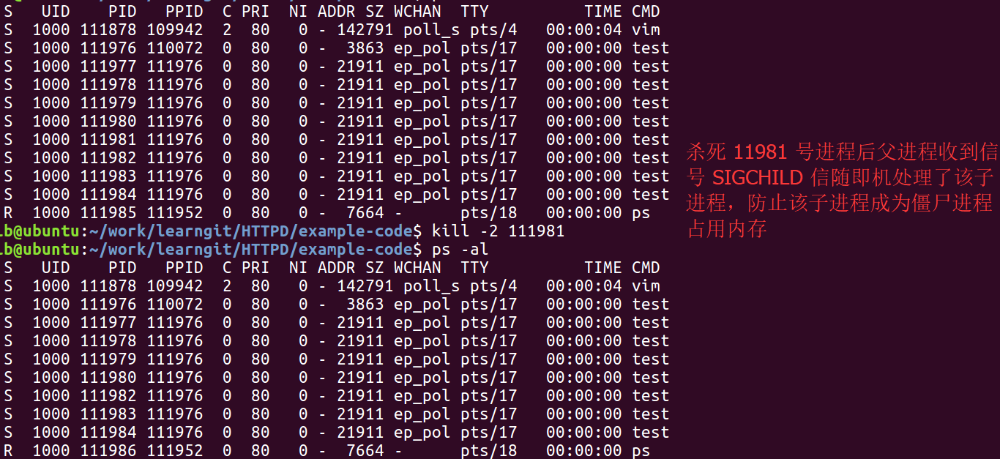

##### 半同步/半异步进程池实现 web 服务器
[源代码](https://github.com/Jastry/Data-Struct-Algorithm/blob/master/HTTPD/example-code/processpool.h)
> 程序开始时创建一个监听套接字，该套接字被接下来创建的进程池中所有子进程所共享，这么做的目的是为了让父进程负责监听客户端连接，一旦有客户连接，父进程随即从进程池中选取一个子进程，通过管道( m_pipefd ) 向子进程发送一个 new_conn（它是一个整型，值为1），同时将该客户所对应的套接字添加至关心事件中。

```c
for (int i = 0; i < number; ++i) {
            int sockfd = events[i].data.fd;
            if ( sockfd == m_listenfd ) {
                int i = sub_process_counter;
                /* 随机从进程池找一个孩子让其服务该连接 */
                do {
                    if ( m_sub_process[i].m_pid != -1 ) {
                        break;
                    }
                    i = (i+1) % m_process_number;
                } while (i != sub_process_counter );

                if ( m_sub_process[i].m_pid == -1 ) {
                    m_stop = true;
                    break;
                }
                sub_process_counter = (i+1) % m_process_number;
                send( m_sub_process[i].m_pipefd[0],
                      (char*)&new_conn, sizeof(new_conn), 0);
                printf("send request to child %d\n", i);
            }
```
> 其中管道 m_pipefd 是在创建进程池的时候初始化的，父进程负责往管道写，子进程负责从管道读。没个子进程都通过其在进程池中的序号值 m_idx 找到与父进程通信的管道。
```c
/* 创建 process_number 个子进程，并让他门建立和父进程之间通信管道 */
    int i = 0;
    for (; i < process_number; ++i) {
        int ret = socketpair(PF_UNIX, SOCK_STREAM, 0, m_sub_process[i].m_pipefd);
        assert(0 == ret);
        
        m_sub_process[i].m_pid = fork();
        assert(m_sub_process[i].m_pid >= 0);
        if (m_sub_process[i].m_pid > 0) {	//father
            close(m_sub_process[i].m_pipefd[1]);
            continue;
        } else {						//child
            close(m_sub_process[i].m_pipefd[0]);
            m_idx = i;
            break;
        }
    }
```

> 子进程需要监听管道文件描述符 pipefd，因为父进程通过它来通知子进程 accept 新连接。当某一个子进程监听到客户后，将其加入到关心事件中，以后若此事件再次就绪子进程就调用 user[clientfd] 的处理客户请求。

`run_child`
```c
if ( (sockfd == pipefd) && ( events[i].events & EPOLLIN )) {
                int client = 0;
                /*
                 * 从父子进程之间的管道读取数据，并将结果保存在 client 中。
                 * 如果读取成功则表示有新用户连接 
                 */
                ret = recv( sockfd, ( char* )&client, sizeof(client), 0 );
                if ( ( ( ret < 0) && ( errno != EAGAIN )) || ret == 0) {
                    continue;
                } else {
                    struct sockaddr_in client_address;
                    bzero(&client_address, sizeof(client_address));
                    socklen_t addr_len = sizeof(client_address);
                    int connfd = accept(m_listenfd, (struct sockaddr*)&client_address, &addr_len);
                    printf("get a client ip %s, port is %d \n", inet_ntoa(client_address.sin_addr), ntohs(client_address.sin_port));
                    if (connfd < 0) {
                        perror("accept");
                        continue;
                    }
                    addfd(m_epollfd, connfd);

                    /* 
                     * 模板类 T 必须事先 init 方法，
                     * 以初始化一个客户连接。我们直接用 connfd 
                     * 来索引逻辑处理对象（T 类型的对象),以提高程序效率
                     */
                    users[connfd].init( m_epollfd, connfd, client_address );
                }
            }
```
> 通过在 epoll_wait 获得的与客户通信的 fd，通过 fd 标识是哪个 user 处理该客户请求，其中 sockfd，是从就绪队列里的就绪事件中读取到的。
```c
 /* 如果是其他可读事件一定是客户连接请求到来。调用逻辑处理对象的 process 方法处理之 */
            else if (events[i].events & EPOLLIN) {
                users[sockfd].process();
            }
```
-----
##### 客户连接
> 父进程监听事件就绪，用随即算法从子进程池中选出一个，往该子进程的管道上发送一个整型。子进程发现被监听的管道文件就绪了就明白是父进程通知自己接受客户连接，随即初始化自己的 user 数组，user 数组存放的时 user 类，该类有两大功能，初始化客户连接，处理客户请求。在处理客户连接时调用 user[clientfd].init，在处理客户请求时调用 user[sockfd].process，其中clientfd 就是从 accept 返回的文件描述父 ，sockfd 是从就绪队列中 struct events 结构体中读取的 成员。以后只接通过 user[i] 处理该客户的所有需求。

##### 客户退出
当 epoll_wait 返回后，从该客户对应的 sockfd 读取数据时发现返回值为 0，则表示该客户退出，子进程将其从关心事件中删除。

##### sig_pipefd 就绪
1. 父进程
父进程和子进程在一开始注册了 SIGINT(2),SIGCHILD(17),SIGPIPE(13),SIGTERM(15)，的处理方法，当收到 SIGCHILD,信号时，表示有子进程退出，但父进程不知道是谁退出所以 waitpid 第一个参数添 -1，并且父进程不知道有几个子进程退出，所以需要循环等待一遍，如果所有子进程的状态都是退出，在执行随即选取子进程时就会退出。

如果是 SIGINIT or SIGTERM ，父进程将杀死所有子进程，将退出标识 m_stop 置为 true。随即在下次循环时退出。

2. 子进程
子进程受到 SIGINT or SIGTERM 信号后将 m_stop 置成 true，释放掉自己创建的的用户表，关闭掉 m_listenfd，其实该文件打开的次数减一。


因为子进程需要同时处理多个客户，所以子进程可能 fork 出了孙子进程，所以在收到 SIGCHILD 信号时也会 waitpid，处理孙子进程退出。避免内存泄漏。

### 温馨提示：
以上是整个半同步半异步进程池实现 web 服务器的主要框架。将代码自己撸一遍比什么都强。