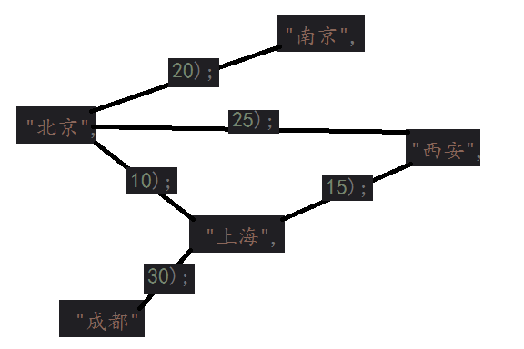
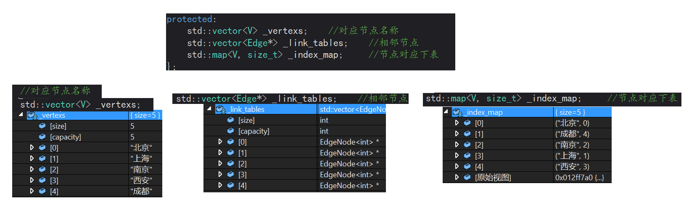
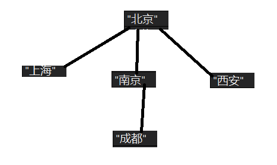

###### 本篇博客主要讲解图的广度优先搜索（BFS）和深度优先搜索（DFS）
###### 参考资料：算法导论
###### <邮箱>：blbagony@163.com
###### [完整代码](https://github.com/Jastry/learngit/tree/master/Algorithm/Graph)
---

在介绍广度优先搜索之前，我们先来说一说基本图的算法
图可以用 G = (V, E) 来表示，其中 V 代表节点，E 代表边。我们可以用两种标准表示方法。一种用邻接链表的组合，一种用邻接矩阵，这两种方法既可以表示有向图也可以表示无向图。再顶点的数量远远小于边的数量的情况下我们一般使用邻接表，反之我们用邻接矩阵。另外如果判断两个点是否想连，我们更倾向于邻接矩阵。下面我们主要用到邻接表

---
##### 用一个例子来说明构成邻接表所需的组件



1. 用三个容器存放节点信息以及边的信息。

2. 用 _Edge 保存边的信息

3. _vertexs 存放节点名字（地名）

4. _index_map 存放地点对应的下表（）

5. _link_tables 存放当前节点的相邻节点的指针


##### 添加边
```
	void AddEdge(const V& src, const V& dst, const W& w)
	{
		assert(_index_map.count(src));
		assert(_index_map.count(dst));

		size_t src_index = _index_map[src];
		size_t dst_index = _index_map[dst];

		_AddEdge(src_index, dst_index, w);
		if (!IsDirected) {
			_AddEdge(dst_index, src_index, w);
		}
	}

	void _AddEdge(size_t src_index, size_t dst_index, const W& w)
	{
		assert(src_index < _vertexs.size() && dst_index < _vertexs.size());
		Edge *edge = new Edge(src_index, dst_index, w);
		//头插
		edge->_next = _link_tables[src_index];
		_link_tables[src_index] = edge;
	}
```
假设现在要添加北京到上海的边，其权值为10
先从 index_map 中找到地点所对应的下表，北京 -> 0,上海->1
new 一个结点，设置源地址（src_index = 0）目的地址（dst = 1）,权值为 10。
给连接表下表对应为北京的位置插入该节点
如果是无向图再给上海对应的位置插入。
邻接表创建好后，现在我们就有了一张图。

---
##### 广度优先搜索
广度优先搜索是最简单的图的搜索算法之一，也是许多重要的图算法原型。[Prim 的最小生成树算法]() 和 [Dijkstra 单元最短络路径算法]()都使用了类似广度优先的思想。

该算法能够计算出能够从源节点 s ，到每个节点距离（最少的边数）。同时生成一颗“广度优先搜索树”。该树以源节点 s 为根节点，包含所有可以从 s 到达的节点。（以北京为例）


##### 实现
在执行广度优先搜索过程中制造出一颗广度优先搜索树，假设以北京为源节点，首先开辟一个数组 visited，用来保存当前需要访问的节点是否在之前已经被访问过了，在创建一个队列，用来管理邻接的接点。访问过后标记该节点已经被访问，如果没有就放到队列中。
先把北京对应的下标（0）放进去，判断北京市否被访问过（从 visited[0] 里面看），如果没有就访问，并把与北京相连的并且没被访问过的地点(上海、南京、西安)对应的下标 push 到队列中。一直到所有点都被访问过。

```
	void bfs(size_t head = 0)
	{
		std::vector<bool> visited(_vertexs.size(), false);	//判断该节点是否访问过
		std::queue<int> q;	//用来存放对应节点下标
		q.push(head);
		while (!q.empty()) {
			int front = q.front();	
			q.pop();
			if (!visited[front]) {
				std::cout << _vertexs[front] << "->";
				visited[front] = true;	//标记为访问过
				Edge *edge = _link_tables[front];
				while (edge) {
					if (!visited[edge->_dst]) {	//遍历相邻的节点
						q.push(edge->_dst);
					}
					edge = edge->_next;
				}
			}
		}
		std::cout << "\n";
	}
```

