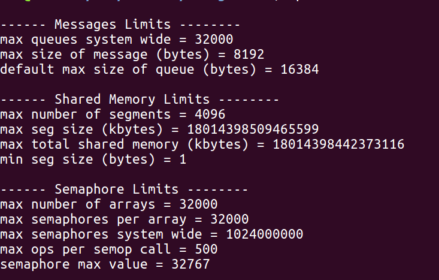
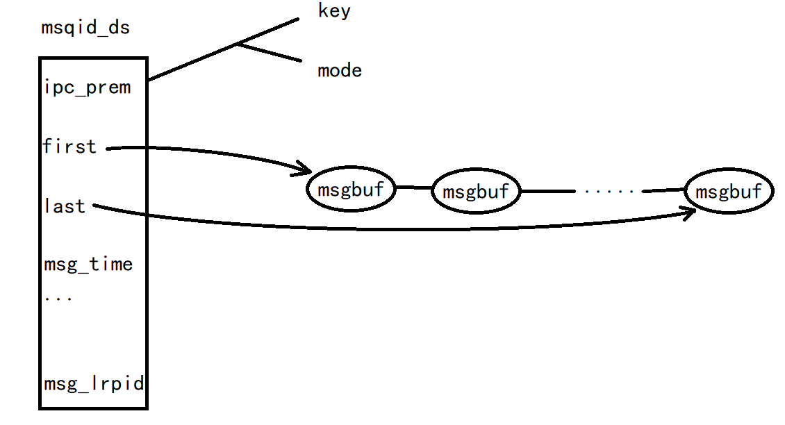

##### 进程间通信之消息队列

- 消息队列实际上是由内核管理的一个链接表，每个消息队列有自己的标示符标识 1. <font color = #0x00ff00>msqid</font>。

1. <font color = #0x00ff00> msgget </font>用于创建一个新队列或打开一个现存的队列。

2. <font color = #0x00ff00>msgsnd </font>将消息添加到队列尾端。每个消息包含一个正长整形字段，一个非负长度以及实际数据字节（对应于长度），所有这些都在将消息发送给消息队列时，传送给  msgsnd<。
3. <font color = #0x00ff00> msgrcv </font>用于从消息队列中取信息。因为不一定要以先进先出的顺序取数据，也可按照消息的类型字段取消息。

- 查看 <font color = #0x00ff00>ipcs -m</font>
- 删除 <font color = #0x00ff00> ipcrm -q msqid</font>

---
##### IPC 对象数据结构
内核为每一个 IPC 对象维护一个数据结构 <font color = #0x00ff00>ipc_prem</font>，该结构体规定了权限和所有者，在创建 IPC 结构时，对所有字段都赋初值。以后，可以调用 msgctl、semctl 或 shmctl 修改 uid、gid 和 mode 字段。为了改变这些值，调用进程必须是 IPC 结构的创建者或超级用户。更改这些字段类似于对文件调用 chmod 和 chwon。

```
/* Obsolete, used only for backwards compatibility and libc5 compiles */
struct ipc_perm
{
	__kernel_key_t	key;
	__kernel_uid_t	uid;
	__kernel_gid_t	gid;
	__kernel_uid_t	cuid;
	__kernel_gid_t	cgid;
	__kernel_mode_t	mode; 
	unsigned short	seq;
};

```
---
##### 结构限制

- 三种 IPC 结构（消息队列、共享内存和信号量）都有内置限制。这些限制大多可以通过重新配置内核而加以更改，使用命令 `ipcs -l` 查看。

/
每个消息队列都有一个<font color = #0x00ff00> msqid_ds </font>可以看到第一个条目就是 ipc_prem 结构体，它是共有的，后面都时消息队列私有的成员。
```
/* Obsolete, used only for backwards compatibility and libc5 compiles */
struct msqid_ds {
	struct ipc_perm msg_perm;
	struct msg *msg_first;		/* first message on queue,unused  */
	struct msg *msg_last;		/* last message in queue,unused */
	__kernel_time_t msg_stime;	/* last msgsnd time */
	__kernel_time_t msg_rtime;	/* last msgrcv time */
	__kernel_time_t msg_ctime;	/* last change time */
	unsigned long  msg_lcbytes;	/* Reuse junk fields for 32 bit */
	unsigned long  msg_lqbytes;	/* ditto */
	unsigned short msg_cbytes;	/* current number of bytes on queue */
	unsigned short msg_qnum;	/* number of messages in queue */
	unsigned short msg_qbytes;	/* max number of bytes on queue */
	__kernel_ipc_pid_t msg_lspid;	/* pid of last msgsnd */
	__kernel_ipc_pid_t msg_lrpid;	/* last receive pid */
};
```


---
```
##### msgget

#include <sys/types.h>
       #include <sys/ipc.h>
       #include <sys/msg.h>

       int msgget(key_t key, int msgflg);
	//成功返回 msg queue 的标识符，出错返回 -1
	//
```
- IPC_CREAT 如果IPC不存在，则创建⼀个IPC资源，否则打开操作。
- IPC_EXCL 只有在共享内存不存在的时候，新的共享内存才建⽴，否则就产⽣错误。
- 如果单独使⽤IPC_CREAT，XXXget()函数要么返回⼀个已经存在的共享内存的操作符，要么返回⼀个新建的共享内存的标识符。如果将IPC_CREAT和IPC_EXCL标志⼀起使⽤，XXXget()将返回⼀个新建的IPC标识符；如果该IPC资源已存在，或者返回-1。IPC_EXEL标志本⾝并没有太⼤的意义，但是和IPC_CREAT标志⼀起使⽤可以⽤来保证所得的对象是新建的，⽽不是打开已有的对象。

---
##### msgsnd / msgrcv
```
       #include <sys/types.h>
       #include <sys/ipc.h>
       #include <sys/msg.h>

       int msgsnd(int msqid, const void *msgp, size_t msgsz, int msgflg);

       ssize_t msgrcv(int msqid, void *msgp, size_t msgsz, long msgtyp,
                      int msgflg);
	
```

- On failure, errno is set to one of the following values:

><font color = #00cc00>EACCES</font> A message queue exists for key, but the calling process does not have permission to access the queue, and does not have the CAP_IPC_OWNER capability.
有一个的消息队列，但是调用进程没有权限访问这个队列，并且没有这个队列 CAP_IPC_OWNER 的能力。

><font color = #00cc00>EEXIST</font> IPC_CREAT and IPC_EXCL were specified in msgflg, but a message queue already exists for key.
尝试以 key 作为键值创建一个消息队列，但该消息队列已经存在
><font color = #00cc00>ENOENT</font> No message queue exists for key and msgflg did not specify IPC_CREAT.
没有以 key 为键值存在的消息队列
><font color = #00cc00>ENOMEM</font> A message queue has to be created but the system does not have enough memory for the new data structure.
系统没有足够的空间创建消息队列
><font color = #00cc00>ENOSPC</font> A message queue has to be created but the system limit for the maximum number of message queues (MSGMNI) would be exceeded.
消息队列已经创建，但达到系统上线
