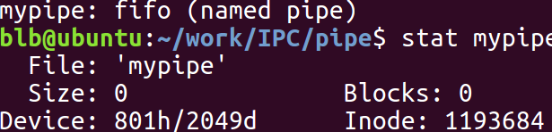

##### 星期三, 13. 十二月 2017 06:34下午 
##### 本篇博客主要讲解用于进程间通信的匿名管道和命名管道
##### 参考资料：UNIX环境高级编程
##### 邮箱：blbagony@163.com

---
##### 匿名管道
```
       #include <unistd.h>

       int pipe(int pipefd[2]);
       //成功返回 0，失败返回 -1
```
##### 管道的五个特性
1. （匿名管道）适用于有血缘关系的进程（命名管道可以满足无血缘关系的两个进程通信）
2. 管道提供流式服务，即面向字节流
3. 半双工，即单向通信，如果想要实现全双工就创建两个管道
4. 管道的生命周期随进程，即进程结束，管道文件资源随即被系统释放
5. 自带同步与互斥机制（如果管道写满了就不能在写，如果管道里尝试读管道的进程就会阻塞）进程 A 在往管道中写的时候进程 B 就不能读取管道之中的数据，进程 B 在读取管道数据的时候，进程 A 就不能在往管道中写数据。

#####测试 Ubuntu 中管道的大小
让父进程一直往管道中写书据，而不让子进程读数据(子进程 sleep)，打印管道当前管道被写入多少数据

管道的大小 645536 单位是字节
[测试代码](https://github.com/Jastry/Blog/tree/master/IPC/pipe)


##### 具体使用
现在模拟一个情况，父进程网管道里写数据所以父进程需关闭读端。子进程从管道里读书据所以关闭写端<font color = #00ff>管道适用于有血缘关系的进程</font>，就这样父进程一直写，子进程一直读,<font color = #00ff>管道的单向通信</font>。我们可以发现子进程每次写完后敲下回车键，这时父进程才可以从管道中读取数据，这就是<font color = #00ff>自带同步机制</font>，父进程每次调用 write 往管道中写数据是以字节为单位，子进程调用 read 从管道里取数据同样以字节为单位这就是<font color = #00ff>管道的面向字节流服务</font> 。当程序结束后管道随即被操作系统释放，<font color = #00ff>管道随进程</font>。
[使用代码](https://github.com/Jastry/Blog/tree/master/IPC/pipe)

##### 几种特殊情况
注意，这是在进程 A 和进程 B 有血缘关系的情况下。
1. 当进程 A 一直往管道中写数据，进程 B 却一直不读数据，<font color = #00ffcc>当管道被写满后，进程 A 将被阻塞，直到进程 B 将管道中的数据读走。</font>。

2. 当进程 A 不向管道中写数据，进程 B 一直从管道中取数据，此时进程 B 被阻塞，很容易理解，管道中没有数据，进程 B 如何读。

3. 当进程 A 往管道中写数据，此时操作系统如果发现读管道的文件描述符都已关闭，则操作系统会给 A 进程发送 SIGPIP 信号，默认动作是退出。

4. 当进程 B 从管道中读数据，此时操作系统如果发现往管道写数据的文件描述符都已关闭，此时进程 B 将读到文件结束符。


---
##### 命名管道
```
       #include <sys/types.h>
       #include <sys/stat.h>

       int mkfifo(const char *pathname, mode_t mode);
	//成功返回 0，失败返回 -1 
```
pathname 创建的文件为管道文件，mode 指定文件权限
特殊情况与命名管道类似。

##### 为什么管道文件间没有消失，还说管道生命周期随进程
生命周期也随进程，不冲突，虽然磁盘上能看到，但核心内容即分配的内存已经释放，下一次打开会分配新的内存。
文件虽然存在,但操作系统为其分配的内存已经没了（管道里的数据被操作系统回收了）。


##### 与匿名管道的对比：
1. 创建方式不同
2. 适用范围不同
##### 具体使用案例
因为命名管道适用于两个没有血缘关系的进程通信，所以可以实现 server 进程向 client 进程发数据，而 client 进程回显 server 发过来的数据。 
[代码实现](https://github.com/Jastry/Blog/tree/master/IPC/pipe)
